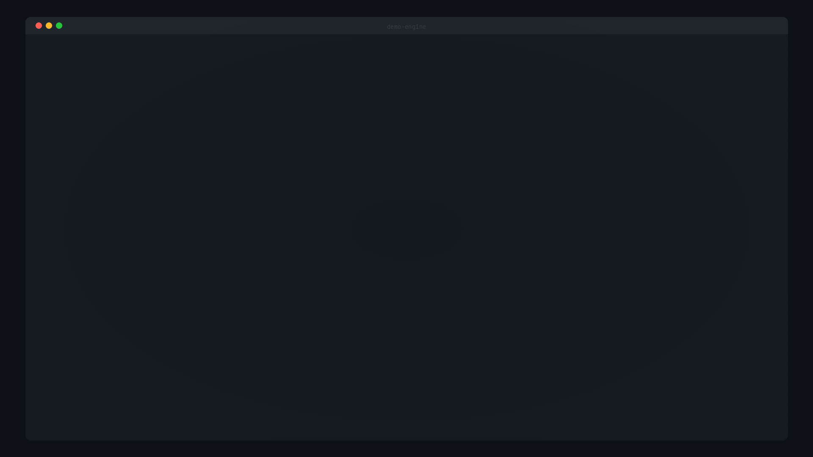
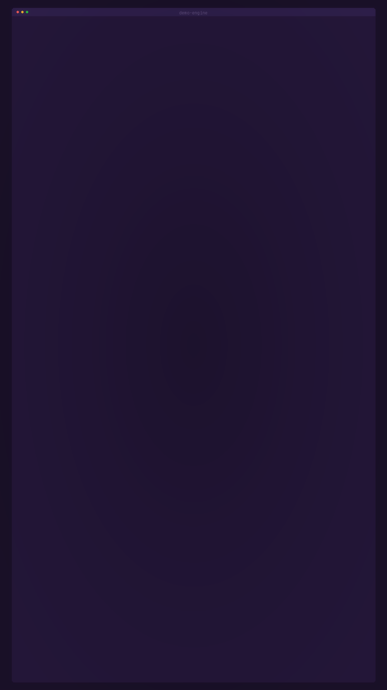

<div align="center">

# Terminal Demo Engine

Generate themed terminal demo GIFs, MP4s, and WebMs from YAML scene scripts.


<sub>Synthwave theme — CRT scanlines, glow, vignette</sub>

</div>

---

## Themes

<table>
<tr>
<td align="center" width="50%">

### Glitch


</td>
<td align="center" width="50%">

### Matrix


</td>
</tr>
<tr>
<td align="center" width="50%">

### Ops



</td>
<td align="center" width="50%">

### Minimal


</td>
</tr>
</table>

<div align="center">

### 9:16 Vertical



</div>

| Theme | Look | CRT | Glow |
|-------|------|:---:|:----:|
| `synthwave` | Purple/pink neon | ✓ | High |
| `glitch` | Dark blue | ✓ | Medium |
| `matrix` | Green on black | ✓ | High |
| `minimal` | Clean dark | — | — |
| `ops` | GitHub dark | — | Low |

Themes are JSON files in `themes/`. Drop in a new file to add one — no code changes needed.

```json
{
  "id": "mytheme",
  "colors": {
    "bg": "#0a0a0a",
    "text": "#e0e0e0",
    "cmd": "#67e8f9",
    "success": "#86efac",
    "warn": "#fbbf24",
    "accent": "#c084fc"
  },
  "effects": {
    "crt": true,
    "scanlines": 0.12,
    "glow": 0.4,
    "noise": 0.04,
    "vignette": 0.2
  }
}
```

---

## Quickstart

```bash
pip install -e .

./record-demo.sh --theme glitch --preset short --export gif

python3 -m demo_engine --theme synthwave --preset cinematic --export all

python3 -m demo_engine --scenario launch_day --theme ops --export mp4

# vertical cut for stories/reels
./record-demo.sh --theme glitch --preset short --aspect 9:16 --export all --cut 15s

# reproducible output
python3 -m demo_engine --theme matrix --preset standard --seed 42 --export gif
```

### Requirements

- Python >= 3.11
- [Pillow](https://pillow.readthedocs.io/) >= 10.0, [PyYAML](https://pyyaml.org/) >= 6.0, [fonttools](https://github.com/fonttools/fonttools) >= 4.40
- [ffmpeg](https://ffmpeg.org/) for MP4/WebM export
- A [Nerd Font](https://www.nerdfonts.com/) (JetBrainsMono or CaskaydiaMono recommended)

---

## Presets

| Preset | Duration | FPS |
|--------|----------|-----|
| `short` | 8–15s | 24 |
| `standard` | 20–30s | 30 |
| `cinematic` | 35–60s | 30 |

---

## Scene DSL

Scenes are YAML files in `scenes/` that define what the demo does:

```yaml
id: my_demo
title: "My Cool Demo"

steps:
  - type: banner
    banner: demo

  - type: command
    text: 'ls -la'
    mode: fake
    output:
      - "drwxr-xr-x  5 user group  160 Jan 15 10:00 src/"
      - "-rw-r--r--  1 user group 1234 Jan 15 09:55 main.ts"

  - type: spinner
    label: "Installing dependencies"
    cycles: 20

  - type: progress
    label: "Building project"
    width: 30

  - type: transition
    transition: glitch
    duration_ms: 200
```

### Step types

| Type | What it does | Key fields |
|------|--------------|------------|
| `banner` | ASCII art header | `text`, `banner` |
| `line` | Text line | `text`, `style` |
| `command` | Fake terminal command with output | `text`, `output[]`, `mode` |
| `spinner` | Spinner animation | `label`, `cycles` |
| `progress` | Progress bar | `label`, `width` |
| `transition` | Visual transition | `transition`, `duration_ms` |
| `pause` | Delay | `duration_ms` |

Styles: `default`, `command`, `success`, `warn`, `error`, `dim`, `accent`

Template variables: `{{workspace}}`, `{{theme}}`, `{{date}}`

### Built-in scenes

- `default_glitch` — pipeline rebuild sequence
- `launch_day` — deploy and ship
- `incident_recovery` — alert, triage, resolve
- `migration_story` — database migration

---

## CLI

```
python3 -m demo_engine [OPTIONS]

Theme & Scene:
  --theme NAME          synthwave, glitch, matrix, minimal, ops
  --scenario NAME       Scene file name or path
  --list-themes         List available themes
  --list-scenes         List available scenes

Timing:
  --preset NAME         short, standard, cinematic
  --speed FLOAT         Speed multiplier (default: 1.0)

Display:
  --aspect RATIO        16:9, 1:1, 9:16
  --font-profile NAME   nerd-safe, classic
  --font-strict         Fail on missing glyphs

Export:
  --export FORMAT       gif, mp4, webm, all (default: gif)
  --outdir PATH         Output directory
  --cover MODE          auto, frame:N, none
  --cut DURATION        8s, 15s, 30s, 45s

Audio:
  --audio on|off        Soundtrack (default: off)

Determinism:
  --seed INT            Random seed

Debug:
  --dry-run             Print timeline, don't render
  --glyph-audit         Run glyph audit and exit
  --keep-workspace      Keep temp workspace
```

---

## Font fallback

Pillow doesn't do automatic font fallback, so the engine checks each character against a font stack and picks the best match:

1. JetBrainsMono Nerd Font Mono
2. CaskaydiaMono Nerd Font Mono
3. Noto Sans Symbols2

Themes can define a `glyph_map` to substitute characters that don't render:
```json
{ "🚀": ">>", "✔": "✓" }
```

```bash
python3 scripts/glyph-audit.py          # audit all themes and scenes
python3 scripts/glyph-audit.py --strict  # exit 1 on any missing glyph
```

---

## Architecture

```
record-demo.sh              Shell wrapper
scripts/
  render-demo.py            CLI entrypoint
  glyph-audit.py            Font/glyph coverage
  build-demo-assets.py      Generate overlay assets

demo_engine/
  cli.py                    Arg parsing, orchestration
  config.py                 Configuration
  terminal_parser.py        CR/LF-aware stream parser
  timeline.py               Timeline events
  scenes.py                 YAML scene loader
  themes.py                 Theme loader/validator
  presets.py                Timing presets
  fonts.py                  Font discovery, glyph audit
  renderer.py               Pillow frame renderer
  effects.py                CRT, glow, noise, vignette, glitch
  export.py                 GIF/MP4/WebM export
  capture.py                Asciicast v2 parser
  audio.py                  Soundtrack/SFX

themes/*.json               Theme definitions
scenes/*.yaml               Scene scripts
assets/                     Overlays, audio, branding
tests/                      Tests
```

---

## Troubleshooting

<details>
<summary>Missing fonts</summary>

```bash
# Arch
yay -S ttf-jetbrains-mono-nerd

# Ubuntu/Debian
wget -P ~/.local/share/fonts https://github.com/ryanoasis/nerd-fonts/releases/download/v3.0.2/JetBrainsMono.zip
unzip ~/.local/share/fonts/JetBrainsMono.zip -d ~/.local/share/fonts
fc-cache -fv
```
</details>

<details>
<summary>ffmpeg not found</summary>

```bash
sudo pacman -S ffmpeg    # Arch
sudo apt install ffmpeg  # Ubuntu
```
</details>

<details>
<summary>GIF too large</summary>

Use `--preset short`, `--cut 15s`, or `--aspect 1:1` to reduce size.
</details>

<details>
<summary>Tofu characters</summary>

```bash
python3 scripts/glyph-audit.py --strict
```
Add substitutions to your theme's `glyph_map`.
</details>

---

MIT License
